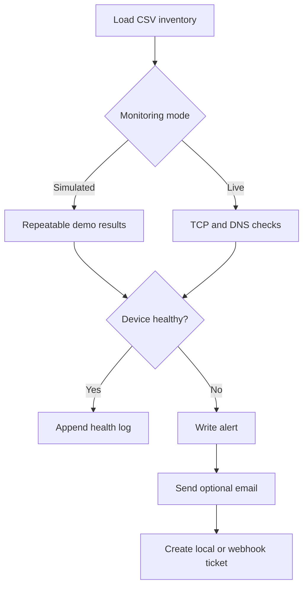

# Network DNS Monitor


A Python network-operations project that checks device availability, validates
expected IPv4 records, records healthy results, sends optional email alerts,
and creates incident tickets through either local JSON logs or a REST webhook.

The repository includes a deterministic simulation mode, so the complete
incident workflow can be demonstrated safely without access to a production
network.

## Why this project matters

Network and DNS failures often require the same repetitive response: identify
the affected device, capture evidence, notify operations, and open a ticket.
This project turns that workflow into a repeatable command-line process.

It demonstrates:

- CSV inventory parsing and validation
- TCP availability checks with configurable timeouts
- IPv4 DNS record validation
- Healthy, unavailable, and DNS-drift classifications
- Structured JSON Lines alert and ticket records
- Optional SMTP email notifications
- Optional bearer-authenticated REST ticket creation
- Continuous monitoring with a configurable interval
- Environment-variable configuration for secrets
- Unit tests and GitHub Actions CI

## Monitoring workflow



## Quick start

Python 3.11 or newer is recommended.

```bash
git clone https://github.com/manuelii/network-dns-monitor.git
cd network-dns-monitor

python -m venv .venv
source .venv/bin/activate
python -m pip install -e .

network-dns-monitor --mode simulated
```

Windows PowerShell activation:

```powershell
.venv\Scripts\Activate.ps1
```

The example inventory intentionally contains:

- one healthy device
- one unavailable device
- one device with DNS drift

This produces repeatable output without contacting real infrastructure:

```text
Network DNS Monitor | Mode: simulated
Loaded 3 devices from config/devices.csv

Scan 1
Web-Gateway      HEALTHY
Database         DEVICE_UNAVAILABLE
  Database did not respond on db.example.net:5432. Error: simulated timeout
  Ticket: <generated-id>
DNS-Primary       DNS_DRIFT
  DNS-Primary resolved to [203.0.113.99] instead of the expected [203.0.113.53].
  Ticket: <generated-id>

Summary: 1 healthy, 2 incidents, 3 total
```

Generated evidence is written to `logs/`:

- `health.log`
- `alerts.jsonl`
- `tickets.jsonl`

## Continuous monitoring

Run indefinitely with a 30-second interval:

```bash
network-dns-monitor --mode simulated --interval 30 --cycles 0
```

Run exactly five scans:

```bash
network-dns-monitor --mode simulated --interval 10 --cycles 5
```

Press `Ctrl+C` to stop an indefinite run.

## Live mode

Edit `config/devices.csv`, then run:

```bash
network-dns-monitor --mode live --timeout 3
```

Live mode resolves each host and attempts a TCP connection to its configured
service port. Use it only against systems you own or are authorized to monitor.

## Optional email alerts

Copy the values in `.env.example` into your shell environment. The application
does not load or commit a real `.env` file.

```bash
export NDM_SMTP_HOST="smtp.example.net"
export NDM_SMTP_PORT="587"
export NDM_SMTP_USERNAME="monitor@example.net"
export NDM_SMTP_PASSWORD="replace-me"
export NDM_EMAIL_FROM="monitor@example.net"
export NDM_EMAIL_TO="operations@example.net"
export NDM_SMTP_STARTTLS="true"

network-dns-monitor --mode simulated --send-email
```

## Optional ticket webhook

```bash
export NDM_TICKET_WEBHOOK="https://tickets.example.net/api/incidents"
export NDM_TICKET_TOKEN="replace-me"

network-dns-monitor --mode simulated --ticket-backend webhook
```

The webhook receives the device, issue type, details, expected and observed
IPv4 records, UTC timestamp, priority, and generated ticket ID. Without webhook
configuration, tickets are safely written to a local JSON Lines file.

## Inventory format

| Column | Purpose |
| --- | --- |
| `name` | Friendly device name |
| `host` | DNS name or IP address |
| `port` | TCP service port used for availability testing |
| `expected_ipv4` | Semicolon-separated expected IPv4 records |
| `simulated_online` | Repeatable demo availability result |
| `simulated_ipv4` | Repeatable demo DNS result |

The sample inventory uses the documentation-only address ranges defined for
examples and testing.

## Repository layout

```text
network-dns-monitor/
├── config/                  Example device inventory
├── docs/                    Architecture and portfolio notes
├── logs/                    Generated runtime evidence
├── src/network_dns_monitor/ Application package
├── tests/                   Unit tests
├── .github/workflows/       Continuous integration
├── .env.example             Optional integration settings
└── pyproject.toml           Package and CLI configuration
```

## Run tests

```bash
python -m unittest discover -s tests -v
```

GitHub Actions runs the test suite on Python 3.11, 3.12, and 3.13 for every
push and pull request.

## Security choices

- No passwords, private hostnames, or API tokens are stored in source control.
- Tokens and SMTP credentials are supplied through environment variables.
- Example systems use reserved documentation domains and IP ranges.
- Live monitoring is opt-in and all network operations use timeouts.
- The `.gitignore` excludes local secrets, generated logs, and build artifacts.

See [SECURITY.md](SECURITY.md) for reporting and safe-operation guidance.

## Additional documentation

- [Architecture and design decisions](docs/architecture.md)
- [Portfolio and interview notes](docs/portfolio-notes.md)
- [GitHub publishing instructions](docs/github-setup.md)
- [Contributing guidelines](CONTRIBUTING.md)

## License

MIT License. See [LICENSE](LICENSE).
